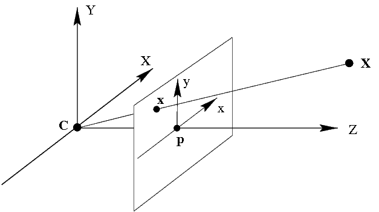
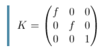
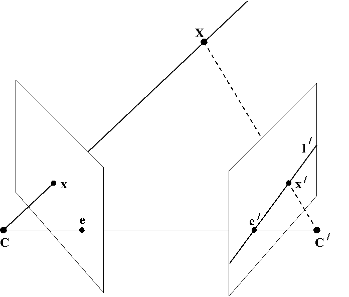
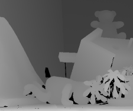
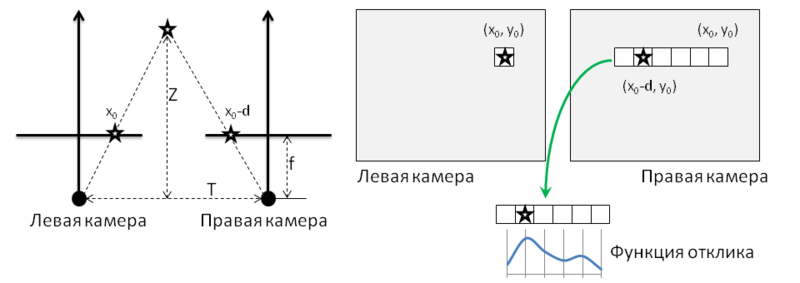

# Базовые понятия CV

[Основы стереозрения / Хабр](https://habr.com/ru/articles/130300/)

В данной статье содержатся базовые сведения о математическом аппарате, используемом в стерео зрении. Идея ее написания появилась после того как я начал работать с методами стерео зрения, в частности использовать алгоритмы реализованные в [OpenCV](http://opencv.willowgarage.com/). Эти алгоритмы зачастую ссылаются на различные понятия, такие как "фундаментальная матрица", "эпиполярная геометрия", "триангуляция". Существуют очень хорошие книжки по компьютерному зрению, в которых описывается, в том числе и стерео зрение и все необходимые понятия, но в них, нередко, бывает представлено слишком много информации для новичка. Здесь же, в краткой форме изложены базовые сведения о том, как работает стерео зрение и основные связанные с ним необходимые понятия:

- проективная геометрия и однородные координаты
- модель камеры
- эпиполярная геометрия (epiporal geomerty), фундаментальная и существенная матрицы (fundamental matrix, essential matrix)
- триангуляция стереопары точек
- карта глубины(depth map), карта смещений(disparity map) и идея, лежащая в основе ее вычисления

Практически весь материал статьи основан на книге *["Multiple View Geometry in Computer Vision"* by Hartley, R. I. and Zisserman, A.](http://www.robots.ox.ac.uk/~vgg/hzbook/), а раздел про построение карты глубины описан на основе материала из *["Learning OpenCV"* by Gary Bradski, Adrian Kaehler](http://shop.oreilly.com/product/9780596516130.do).

Для понимания содержимого статьи достаточно иметь общее представление об аналитической геометрии и линейной алгебре: знать, что такое матрица, вектор, скалярное и векторное произведение.

# 1. Проективная геометрия и однородные координаты

В геометрии стерео зрения значительную роль играет  [проективная геометрия](http://ru.wikipedia.org/wiki/%D0%9F%D1%80%D0%BE%D0%B5%D0%BA%D1%82%D0%B8%D0%B2%D0%BD%D0%B0%D1%8F_%D0%B3%D0%B5%D0%BE%D0%BC%D0%B5%D1%82%D1%80%D0%B8%D1%8F). К проективной геометрии есть несколько подходов: геометрический (подобно Евклидовой геометрии ввести понятие геометрических объектов, аксиом и из этого выводить все свойства проективного пространства), аналитический (рассматривать все в координатах, как в аналитическом подходе к Евклидовой геометрии), алгебраический.

Для дальнейшего изложения в основном понадобиться понимание аналитического подхода к проективной геометрии, и именно он и изложен ниже.

**Точки проективной плоскости.** Рассмотрим двухмерное проективное пространство (которое еще называется проективной плоскостью). В то время как на обычной Евклидовой плоскости точки описываются парой координат (*x*,*y*)*T*, на проективной плоскости точки описываются трехкомпонентным вектором (*x*,*y*,*w*)*T*. При этом для любого ненулевого числа *a*, векторы (*x*,*y*,*w*)*T* и (*ax*, *ay*, *aw*)*T* соответствуют одной и той же точке. А нулевой вектор (0,0,0)*T* не соответствует никакой точке и выкидывается из рассмотрения. Такое описание точек плоскости называется однородными координатами (homogeneous coordinates).

Точкам проективной плоскости можно сопоставить точки обычной Евклидовой плоскости. Координатному вектору (*x*,*y*,*w*)*T* при *w* 0 сопоставим точку Евклидовой плоскости с координатами (*x*/*w*, *y*/*w*)*T*. Если же *w* = 0, т.е. координатный вектор имеет вид (*x*, *y*, 0*T*), то будем говорить, что эта точка в бесконечности. Таким образом, проективную плоскость можно рассматривать как Евклидовую плоскость, дополненную точками из бесконечности.

Перейти от однородных координат (*x*, *y*, *w*)*T* к обычным Евклидовым можно путем деления координатного вектора на последнюю компоненту и последующего ее отбрасывания (*x*,*y*,*w*)*T* (*x*/*w*,*y*/*w*)*T*. А от Евклидовых координат (*x*,*y*)*T* перейти к однородным можно за счет дополнения координатного вектора единичкой: (*x*,*y*)*T* (*x*,*y*,1)*T*

**Прямые на проективной плоскости.** Любая прямая на проективной плоскости описывается, подобно точке, трехкомпонентным вектором *l* = (*a*,*b*,*c*)*T*. Опять же вектор, описывающий прямую, определен с точностью до ненулевого множителя. При этом уравнение прямой будет иметь вид: *lT* *x* = 0.

В случае, когда *a*2 + *b*2 0 мы имеем аналог обычной прямой *ax* + *by* + *c* = 0. А вектор (0,0,*w*) соответствует прямой лежащей в бесконечности.

**Трехмерное проективное пространство.** По аналогии с проективной плоскостью, точки трехмерного проективного пространства определяются четырехкомпонентным вектором однородных координат (*x*,*y*,*z*,*w*)*T*. Опять же для любого ненулевого числа *a*, координатные вектора (*x*,*y*,*z*,*w*)*T* и (*ax*,*ay*,*az*,*aw*)*T* соответствуют одной и той же точке.

Как в случае проективной плоскости, между точками трехмерного Евклидова пространства и трехмерного проективного пространства можно установить соответствие. Вектору однородных координат (*x*,*y*,*z*,*w*)*T* при *w* 0 соответствует точка Евклодова пространства с координатами (*x*/*w*,*y*/*w*,*z*/*w*)*T*. А про точку с вектором однородных координат вида (*x*,*y*,*z*,0)*T* говорят, что она лежит в бесконечности.

**Проективное преобразование.** Еще одна вещь, которая потребуется для дальнейшего изложения — это проективные преобразования (homography, projective transformation — в англ. литературе). С геометрической точки зрения, проективное преобразование — это обратимое преобразование проективной плоскости (или пространства), которое переводит прямые в прямые. В координатах, проективное преобразование выражается в виде невырожденной квадратной матрицы *H*, при этом координатный вектор *x* переходит в координатный вектор *x*' по следующей формуле: *x*' = *H* *x*.

# 2. Модель проективной камеры

> Рисунок 1: **Модель камеры.** *C* — центр камеры, *Cp* — главная ось камеры. Точка *X* трехмерного пространства проецируется в точку *x* — на плоскости изображения.
> 

Современные CCD-камеры хорошо описываются с помощью следующей модели, называемой проективной камерой (projective camera, pinhole camera). Проективная камера определяется *центром камеры*, *главной осью* — лучом начинающимся в центре камеры и направленным туда, куда камера смотрит, *плоскостью изображения* — плоскостью на которую выполняется проецирование точек, и системой координат на этой плоскости. В такой модели, произвольная точка пространства *X* проецируется на плоскость изображения в точку *x* лежащую на отрезке *CX*, который соединяет центр камеры *C* с исходной точкой *X* (см. рис. 1).

Формула проецирования имеет простую математическую запись в однородных координатах:

<aside>
💡 *x* = *P X*

</aside>

где *X* — однородные координаты точки пространства, *x* — однородные координаты точки плоскости, *P* — матрица камеры размера 3 4.

Матрица *P* выражается следующим образом *P* = *KR*[ *I* | -***c***] = *K*[*R*|***t***], где *K* — верхняя треугольная матрица внутренних параметров камеры размера 3 3 (конкретный вид приведен ниже), *R* — ортогональная матрица размера 3 3, определяющая поворот камеры относительно глобальной системы координат, *I* — единичная матрица размера 3 3, вектор ***c*** — координаты центра камеры, а ***t*** = *R**c***.

Стоит отметить, что матрица камеры определена с точностью до постоянного ненулевого множителя, который не изменит результатов проецирования точек по формуле *x* = *P* *X*. Однако этот постоянный множитель обычно выбирается так, что бы матрица камеры имела вышеописанный вид.

В самом простейшем случае, когда центр камеры лежит в начале координат, главная ось камеры сонаправлена оси *Cz*, оси координат на плоскости камеры имеют одинаковый масштаб (что эквивалентно квадратным пикселям), а центр изображения имеет нулевые координаты, матрица камеры будет равна *P* = *K*[*I*|**0**], где

У реальных CCD камер пикселы обычно незначительно отличаются от квадратных, а центр изображения имеет ненулевые координаты. В таком случае матрица внутренних параметров примет вид:

Коэффициенты *f*, *x*, *y* — называются фокусными расстояниями камеры (соответственно общим и вдоль осей *x* и *y*).

Помимо этого, в силу неидеальности оптики, на изображениях, полученных с камер, присутствуют искажения-дисторсии (distortion). Данные искажения имеют нелинейную математическую запись:

где *k*1, *k*2, *p*1, *p*2, *k*3 — коэффициенты дисторсии, являющиеся параметрами оптической системы; *r*2 = *x*'2 + *y*'2; (*x*', *y*') — координаты проекции точки относительно центра изображения при квадратных пикселях и отсутствии искажений; (*x*, *y*) — искаженные координаты точки относительно центра изображения при квадратных пикселях.

Дисторсии не зависят от расстояния до объекта, а зависят только от координат точек, в которые проецируются пиксели объекта. Соответственно для компенсации дисторсий обычно выполняется преобразование исходного изображения полученного с камеры. Это преобразование будет одним и тем же для всех изображений, полученных с камеры, при условии постоянства фокусного расстояния (математически — одной и той же матрицы внутренних параметров).

В ситуации, когда известны внутренние параметры камеры и коэффициенты дисторсии говорят, что камера откалибрована.

# 3. Пара камер

Об определении трехмерных координат наблюдаемых точек можно говорить, когда есть как минимум две камеры.

**Матрицы пары камер, калибровка.** Пусть имеются две камеры, заданные своими матрицами *P* и *P*' в некоторой системе координат. В таком случае говорят, что имеется пара откалиброванных камер. Если центры камер не совпадают, то эту пару камер можно использовать для определения трехмерных координат наблюдаемых точек.

Зачастую, система координат выбирается так, что матрицы камер имеют вид *P* = *K*[*I*|0], *P*' = *K*'[*R*'|*t*']. Это всегда можно сделать, если выбрать начало координат совпадающее с центром первой камеры, и направить ось *Z* вдоль ее оптической оси.

Калибровка камер обычно выполняется, за счет многократной съемки некоторого калибровочного шаблона, на изображении можно легко выделить ключевые точки, для которых известны их относительные положения в пространстве. Далее составляются и решаются (приближенно) системы уравнений, связывающие координаты проекций, матрицы камер и положения точек шаблона в пространстве.

Существуют общедоступные реализации алгоритмов калибровки, например,  [Matlab Calibration toolbox](http://www.vision.caltech.edu/bouguetj/calib_doc/). Так же библиотека  [OpenCV](http://opencv.willowgarage.com/wiki/) включает в себя алгоритмы калибровки камер и поиска калибровочного шаблона на изображении.

**Эпиполярная геометрия.** Перед тем как перейти к описанию собственно метода вычисления трехмерных координат точек, я опишу некоторые важные геометрические свойства, связывающие положения проекций точки трехмерного пространства на изображениях с обеих камер.

> Рисунок 2: Эпиполярная геометрия
> 

Пусть имеются две камеры, как изображено на рисунке 2. *C* — центр первой камеры, *C*' — центр второй камеры. Точка пространства *X* проецируется в *x* на плоскость изображения левой камеры и в *x*' на плоскость изображения правой камеры. Прообразом точки *x* на изображении левой камеры является луч *xX*. Этот луч проецируется на плоскость второй камеры в прямую *l*', называемую эпиполярной линией. Образ точки *X* на плоскости изображения второй камеры обязательно лежит на эпиполярной линии *l*'.

Таким образом, каждой точке *x* на изображении левой камеры соответствует эпиполярная линия *l*' на изображении правой камеры. При этом пара для *x* на изображении правой камеры может лежать только на соответствующей эпиполярной линии. Аналогично, каждой точке *x*' на правом изображении соответствует эпиполярная линия *l* на левом.

Эпиполярную геометрию используют для поиска стереопар, и для проверки того, что пара точек может быть стереопарой (т.е. проекцией некоторой точки пространства).

Эпиполярная геометрия имеет очень простую запись в координатах. Пусть имеется пара откалиброванных камер, и пусть *x* — однородные координаты точки на изображении одной камеры, а *x*' — на изображении второй. Существует такая матрица *F* размера 3 3, что пара точек *x*, *x*' является стереопарой тогда и только тогда, когда:

Матрица *F* называется фундаментальной матрицей (fundamental matrix). Ее ранг равен 2, она определена с точностью до ненулевого множителя и зависит только от матриц исходных камер *P* и *P*'.

В случае, когда матрицы камер имеют вид *P* = *K*[*I*|0], *P*' = *K*'[*R*|*t*] фундаментальная матрица может быть вычислена по формуле:

где для вектора *e* обозначение [*e*]*X* вычисляется как

С помощью фундаментальной матрицы вычисляются уравнения эпиполярных линий. Для точки *x*, вектор, задающий эпиполярную линию, будет иметь вид *l*' = *F* *x*, а уравнение самой эпиполярной линии: *l*'*T* *x*' = 0. Аналогично для точки *x*', вектор, задающий эпиполярную линию, будет иметь вид *l* = *F^T* *x*'.

Помимо фундаментальной матрицы, существует еще такое понятие, как существенная матрица (essential matrix): *E* = *K*'^*T* *F* *K*. В случае, когда матрицы внутренних параметров будут единичными существенная матрица будет совпадать с фундаментальной. По существенной матрице можно восстановить положение и поворот второй камеры относительно первой, поэтому она используется в задачах, в которых нужно определить движение камеры.

**Триангуляция точек (triangulation).** Теперь собственно перейдем к тому, как определить трехмерные координаты точки по координатам ее проекций. Этот процесс в литературе называется триангуляцией.

Пусть имеются две откалиброванные камеры с матрицами *P*1 и *P*2. *x*1 и *x*2 — однородные координаты проекций некоторой точки пространства *X*. Тогда можно составить следующую систему уравнений:

На практике для решения этой системы применяется следующий подход. Векторно умножают первое уравнение на *x*1, второе на *x*2, избавляются от линейно зависимых уравнений и приводят систему к виду *A* *X* = 0, где *A* имеет размер 4 4. Далее можно либо исходить из того вектор *X* является однородными координатами точки, положить его последнюю компоненту равной 1 и решать полученную систему из 3х уравнение с тремя неизвестными. Альтернативный способ — взять любое ненулевое решение системы *A* *X* = 0, например вычисленное, как сингулярный вектор, отвечающий наименьшему сингулярному числу матрицы *A*.

# 4. Построение карты глубины

Карта глубины (depth map) — это изображение, на котором для каждого пикселя, вместо цвета, храниться его расстояние до камеры. Карта глубины может быть получена с помощью специальной камеры глубины (например, сенсор Kinect является своего рода такой камерой), а так же может быть построена по стереопаре изображений.

Идея, лежащая в основе построения карты глубины по стереопаре очень проста. Для каждой точки на одном изображении выполняется поиск парной ей точки на другом изображении. А по паре соответствующих точек можно выполнить триангуляцию и определить координаты их прообраза в трехмерном пространстве. Зная трехмерные координаты прообраза, глубина вычисляется, как расстояние до плоскости камеры.

Парную точку нужно искать на эпиполярной линии. Соответственно, для упрощения поиска, изображения выравнивают так, что бы все эпиполярные линии были параллельны сторонам изображения (обычно горизонтальны). Более того, изображения выравнивают так, что бы для точки с координатами (*x*0, *y*0) соответствующая ей эпиполярная линия задавалась уравнением *x* = *x*0, тогда для каждой точки соответствующую ей парную точку нужно искать в той-же строчке на изображении со второй камеры. Такой процесс выравнивания изображений называют ректификацией (rectification). Обычно ректификацию совершают путем ремеппинга изображения и ее совмещают с избавлением от дисторсий. Пример ректифицированных изображений приведен на рисунке 3, картинки взяты из базы изображений сравнения различных методов построения карты глубины [http://vision.middlebury.edu/stereo](http://vision.middlebury.edu/stereo).

> Рисунок 3: Пример ректифицированных картинок, и соответствующей им disparity map.
> 

После того как изображения ректифицированы, выполняют поиск соответствующих пар точек. Самый простой способ проиллюстрирован на картинке 4 и состоит в следующем. Для каждого пикселя левой картинки с координатами (*x*0, *y*0) выполняется поиск пикселя на правой картинке. При этом предполагается, что пиксель на правой картинке должен иметь координаты (*x*0 — *d*, *y*0), где *d* — величина называемая несоответствие/смещение (disparity). Поиск соответствующего пикселя выполняется путем вычисления максимума функции отклика, в качестве которой может выступать, например, корреляция окрестностей пикселей. В результате получается карта смещений (disparity map), пример которой приведен на рис. 3.

> 
> 
> 
> 
> 
> Рисунок 4: Вычисление карты глубины.
> 

Собственно значения глубины обратно пропорциональны величине смещения пикселей. Если использовать обозначения с левой половины рисунка 4, то зависимость между disparity и глубиной можно выразить следующим способом:

Из-за обратной зависимости глубины и смещения, разрешающая способность систем стерео зрения, которые работают на основе данного метода, лучше на близких расстояниях, и хуже на далеких.