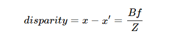

# StereoBM

Created: October 7, 2023 7:38 PM

StereoBM - метод OpenCV для получения карты глубин используя disparity (несоответствие) карты. Работает только для двух стерео съёмки, но, думаю, мы можем похимичить и получить норм результат для моно.

Принцип работы:

$x - x'$ разность координат одной и той же точки с левой и правой камер.

$B$ - расстояние между камер.

$f$ - фокусное расстояние камеры.

$Z$ - расстояние до камеры.(глубина).

[Статья с примером использования](https://docs.opencv.org/4.x/dd/d53/tutorial_py_depthmap.html)

StereoBM принимает дохерища параметров.

[Тут мы можем украсть код и подобрать лучшие для нашей программы.](https://learnopencv.com/depth-perception-using-stereo-camera-python-c/)